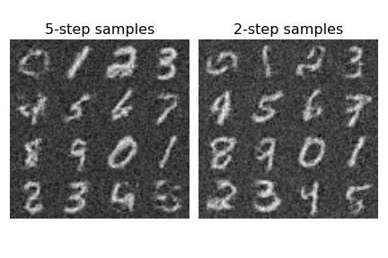

# Consistency Models
_Work in progress._

Implementation of Consistency Models, a class of diffusion-adjacent models introduced in [Song et al 2023](https://arxiv.org/abs/2303.01469), in Jax. When used as standalone generative models, consistency models achieve state of the art performance in one- and few-step generation, outperforming existing techniques distilling diffusion models.

A simple implementation of the discrete-timesteps version is in the notebook [consistency-mnist.ipynb](notebooks/consistency-mnist.ipynb). This example uses a simple [MLP-Mixer](https://arxiv.org/abs/2105.01601) as the backbone for the consistency function $f_\theta(x_t, t)$

## Samples

