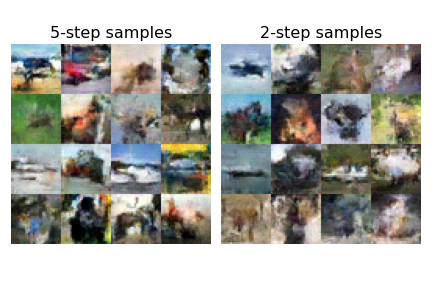

# Consistency Models

## Description

Implementation of Consistency Models, a class of diffusion-adjacent models introduced in [Song et al (2023)](https://arxiv.org/abs/2303.01469), in Jax. 

When used as standalone generative models, consistency models achieve state of the art performance in one- and few-step generation, outperforming existing techniques distilling diffusion models.

A minified, self-contained implementation of the discrete-time version of the model trained on MNIST is in the notebook [consistency-mnist.ipynb](notebooks/consistency-mnist.ipynb).

## Implementation Notes

- This repo uses a simple [MLP-Mixer](https://arxiv.org/abs/2105.01601) as the backbone for the consistency function.
- I only implement what the paper calls consistency training (CT), where the model is trained from scratch, rather than consistency distillation (CD), where the model is distilled from a pre-trained diffusion model.
- The continuous-time objective is implemented, but I have not gotten this to work well for consistency training. In the paper, the authors note, _"For consistency training (CT), we find it important to initialize consistency models from a pre-trained EDM model in order to stabilize training when using continuous-time objectives. We hypothesize that this is caused by the large variance in our continuous-time loss functions"_, so this may not be surprising.

## Usage

Train and logging (optional, through `wandb`):
```
python train.py --config ./config/cifar10.py
```

## Samples

Samples with 5 (left) and 2 (right) step generation, MNIST trained over 200k steps with a batch size of 512 in [consistency-mnist.ipynb](notebooks/consistency-mnist.ipynb).


Samples with 5 (left) and 2 (right) step generation, MNIST trained over ~900k steps with a batch size of 512. These don't look... great, likely because of the choice of MLP-Mixer architecture backbone.

